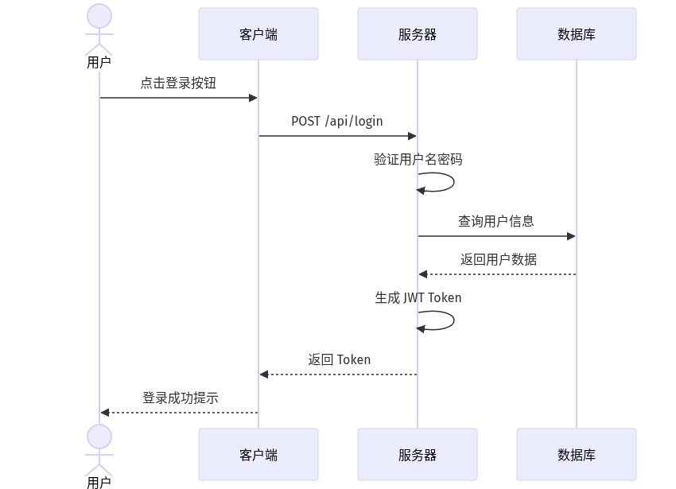
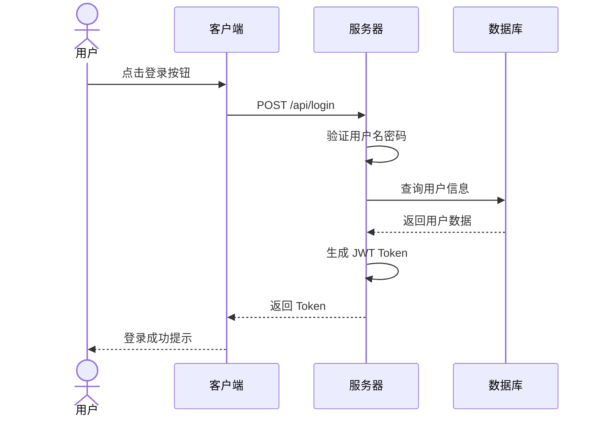

# 时序图生成器

将 Mermaid 时序图代码转换为 PNG 图片的工具。

## Agent Skill 说明

这是一个通用的 Agent Skill，兼容 Claude Code 和其他支持 skill 机制的 AI 编程助手。

**技能配置：**
- **名称**：`sequence-diagram-generator`
- **调用方式**：`/sequence-diagram-generator`
- **所需工具**：`Read`, `Write`, `Bash`, `question`
- **禁用模型调用**：`true`（仅用户可调用）

**兼容的 Agent：**

| Agent | 安装路径 | 备注 |
|-------|---------|------|
| [Claude Code](https://claude.ai/code) | `~/.opencode/skills/` | Anthropic 官方工具 |
| [OpenCode](https://opencode.ai) | `~/.opencode/skills/` | Claude Code 开源替代品 |
| [Cline](https://github.com/cline/cline) | VS Code 插件设置 | 支持自定义指令 |
| [Continue](https://www.continue.dev/) | 配置目录 | 开源 AI 编程助手 |
| [Aider](https://aider.chat/) | 配置文件 | 支持 `.aider.conf.yml` |
| [Cursor](https://www.cursor.com/) | Composer 功能 | 需手动导入为提示词 |
| [GitHub Copilot](https://github.com/features/copilot) | Chat 指令 | 需转换为提示词格式 |
| [Zed AI](https://zed.dev/ai) | Assistant 配置 | 需手动配置 |
| [Windsurf](https://codeium.com/windsurf) | Cascade 配置 | 需手动导入 |

**说明**：
- ✅ **完全兼容**：Claude Code、OpenCode（原生支持 SKILL.md 格式）
- ⚠️ **需适配**：其他 Agent 可能需要将 SKILL.md 转换为各自的配置格式
- 核心功能（Node.js 脚本）在所有环境中都能独立运行

## 系统要求

### 必需条件

- **Node.js 14.0+**（推荐 18.0+）
  - 检查版本：`node --version`
  - 下载地址：https://nodejs.org/

- **网络连接**
  - 需要能访问 `https://kroki.io`（用于生成图片）
  - 备用服务：`https://mermaid.live`（在线编辑器）

### 可选条件

- **Bash 环境**（macOS/Linux 自带，Windows 可通过 Git Bash 或 WSL）
- **curl**（用于 Bash 备用脚本下载图片）

### 验证安装

```bash
# 检查 Node.js
node --version

# 检查网络连接
ping kroki.io
```

## 安装

### 安装到 Claude Code

```bash
# 复制技能到 opencode 技能目录
cp -r .opencode/skills/sequence-diagram-generator ~/.opencode/skills/
```

### 安装到其他 Agent

根据你的 Agent 文档，将技能目录复制到对应的 skills 目录下。通常只需要：
1. 复制整个 `sequence-diagram-generator` 目录
2. 确保 SKILL.md 文件在目录根下
3. 重启 Agent 或刷新技能列表

## 项目结构

```
sequence-diagram-generator/
├── SKILL.md                      # 技能定义文件（Claude Code 使用）
├── README.md                     # 本文档
├── samples/                      # 示例图片目录
│   ├── example-sequence-diagram.png
│   └── sequence_2026-01-31T1041.png  # 登录流程示例
├── scripts/                      # 生成脚本
│   ├── generate.js              # Node.js 主脚本
│   └── generate.sh              # Bash 备用脚本
└── examples/                     # 示例代码（可选）
```

## 在 Agent 中使用

安装后，在支持的 AI 编程助手环境中直接调用：

```
/sequence-diagram-generator
```

**交互流程：**

1. **选择保存目录**（Agent 使用 `question` 工具交互式询问）
   - 提示："请输入时序图保存目录（直接按 Enter 使用默认目录：./sequence_diagrams）："
   - 默认：`./sequence_diagrams`
   - 直接按 Enter 即可使用默认

2. **粘贴代码**
   - 提示："请直接粘贴时序图代码（Mermaid 格式），粘贴完成后按 Enter："
   - 直接粘贴 Mermaid 代码，例如：

```
sequenceDiagram
    actor U as 用户
    participant S as 系统
    U->>S: 登录请求
    S->>S: 验证身份
    S-->>U: 返回 token
```

## 技术说明

### 生成原理

本工具使用 [Kroki.io](https://kroki.io/) 在线服务生成图片：
- 免费、无需注册
- 支持 Mermaid、PlantUML 等多种图表类型
- 无需本地安装额外依赖

### 工作流程

1. 用户输入 Mermaid 时序图代码
2. 脚本通过 HTTPS POST 请求发送到 kroki.io API
3. Kroki 服务渲染图表并返回 PNG 图片数据
4. 脚本保存图片到指定目录

### 备用方案

如果 kroki.io 服务不可用，脚本会自动提供备用链接：
- **Mermaid Live Editor**：在线编辑和预览图表
- **mermaid.ink**：直接图片链接（通过 Bash + curl 尝试下载）

### 网络要求

- **协议**：HTTPS（443 端口）
- **域名**：`kroki.io`
- **方法**：POST 请求，Content-Type: application/json

## 本地开发

### 独立运行脚本

如果你想在本地独立运行生成脚本（不通过 Claude Code）：

```bash
# 方法1：从文件读取
cd .opencode/skills/sequence-diagram-generator
node scripts/generate.js [输出目录] < diagram.mmd

# 方法2：通过管道输入
echo 'sequenceDiagram
    A->>B: 测试' | node scripts/generate.js ./output

# 方法3：使用 Bash 备用脚本
echo 'sequenceDiagram
    A->>B: 测试' | ./scripts/generate.sh
```

### 脚本说明

- `scripts/generate.js` - Node.js 主要脚本
  - 依赖：Node.js 内置模块（fs, path, https, zlib）
  - 无需额外 npm install
  - 支持自定义输出目录参数

- `scripts/generate.sh` - Bash 备用脚本
  - 依赖：bash, curl, base64
  - 当 Node.js 不可用时提供降级方案

## 故障排除

### 问题1："错误：没有接收到时序图代码"

**原因**：没有向脚本提供 Mermaid 代码

**解决**：
- 确保通过管道或重定向传入代码
- 检查代码文件路径是否正确

### 问题2："生成失败: HTTP 5xx" 或超时

**原因**：Kroki 服务暂时不可用或网络问题

**解决**：
- 等待几分钟后重试
- 脚本会自动提供备用链接，可使用 Mermaid Live Editor 在线查看
- 检查网络连接：`curl -I https://kroki.io`

### 问题3：Node.js 未安装

**原因**：系统未安装 Node.js

**解决**：
```bash
# macOS (使用 Homebrew)
brew install node

# Ubuntu/Debian
sudo apt-get install nodejs

# 或使用 nvm 安装特定版本
curl -o- https://raw.githubusercontent.com/nvm-sh/nvm/v0.39.0/install.sh | bash
nvm install 18
nvm use 18
```

### 问题4：权限错误

**原因**：无法写入输出目录

**解决**：
- 检查目录权限：`ls -la [目录]`
- 使用有写入权限的目录
- 或修改目录权限：`chmod 755 [目录]`

### 问题5：生成的图片损坏或无法打开

**原因**：网络传输过程中数据损坏

**解决**：
- 重试生成
- 检查生成的文件大小（正常应该 > 1KB）
- 使用 Mermaid Live Editor 验证代码语法是否正确

## 示例输出

输入代码后，工具会生成类似 `sequence_YYYYMMDD_HHMMSS.png` 的图片文件。

### 示例图片

参考示例图片位于 `samples/` 目录：

- `samples/sequence_2026-01-31T1041.png` - 用户登录流程时序图



**示例代码：**


## Mermaid 语法参考

- [Mermaid 时序图文档](https://mermaid.js.org/syntax/sequenceDiagram.html)
- [Mermaid Live Editor](https://mermaid.live/)（在线练习）
