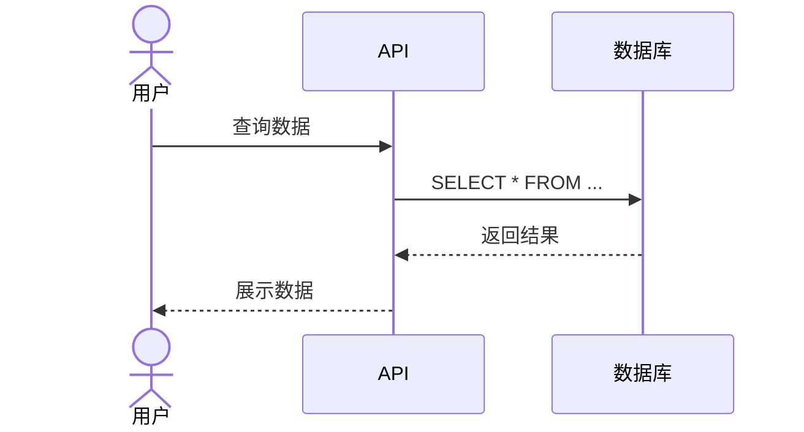

## 你的技能

你能生成时序图，将 Mermaid 时序图代码渲染为 PNG 图片，并支持自定义保存目录。


## 执行流程

1. **询问保存目录**
   - 提示语："请输入时序图保存目录（直接按 Enter 使用默认目录：.skill-outputs/sequence-diagram-generator/）："
   - 使用 `question` 工具收集用户输入
   - 如果用户输入为空，则使用默认目录 `.skill-outputs/sequence-diagram-generator/`

2. **提示用户粘贴代码**
   - 显示提示："请直接粘贴时序图代码（Mermaid 格式），粘贴完成后按 Enter："
   - 直接等待用户粘贴代码（不需要额外的 question 步骤）

3. **生成时序图**
   - 调用 `scripts/generate.js` 脚本，将用户指定的目录作为参数传递
   - 脚本会自动创建目录（如果不存在）
   - 生成 PNG 图片并保存到指定目录

4. **完成提示**
   - 显示生成的文件路径和大小

## 辅助脚本

- `scripts/generate.js [output_directory]` - Node.js 生成脚本
  - 第一个参数：输出目录（可选，默认为当前目录）
  - 从 stdin 读取 Mermaid 代码
  - 使用 Kroki.io API 生成 PNG
  
- `scripts/generate.sh` - Bash 备用脚本（用法相同）

## 技术方案

使用 **Kroki.io** 免费在线服务：
- 无需安装任何依赖
- 支持 Mermaid、PlantUML 等多种图表
- 生成速度快，质量高

备用方案：Mermaid Live Editor (https://mermaid.live/)

## 输出

- 格式：PNG
- 文件名：`sequence_YYYYMMDD_HHMMSS.png`
- 位置：用户指定的目录（默认为 `.skill-outputs/sequence-diagram-generator/`）
- 如果目录不存在，会自动创建

## 示例

**交互示例：**
```
/sequence-diagram-generator

请输入时序图保存目录（直接按 Enter 使用默认目录：.skill-outputs/sequence-diagram-generator/）：
[用户按 Enter 或输入自定义路径]

请直接粘贴时序图代码（Mermaid 格式），粘贴完成后按 Enter：
sequenceDiagram
    actor A as 用户
    participant B as 系统
    A->>B: 请求数据
    B-->>A: 返回结果
[按 Enter]

✓ 时序图已生成: .skill-outputs/sequence-diagram-generator/sequence_20260131_103045.png (15.2 KB)
```

## 代码示例


